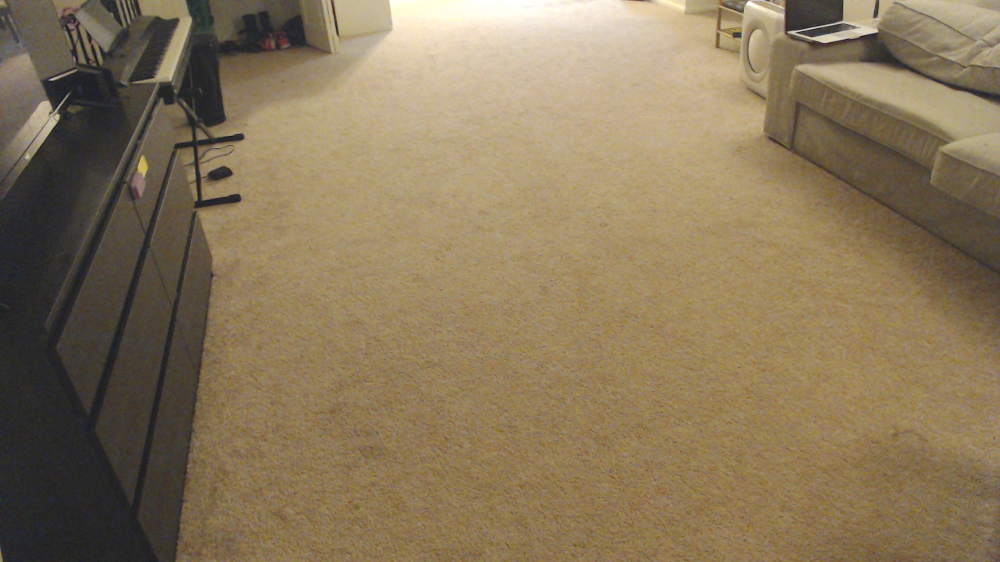
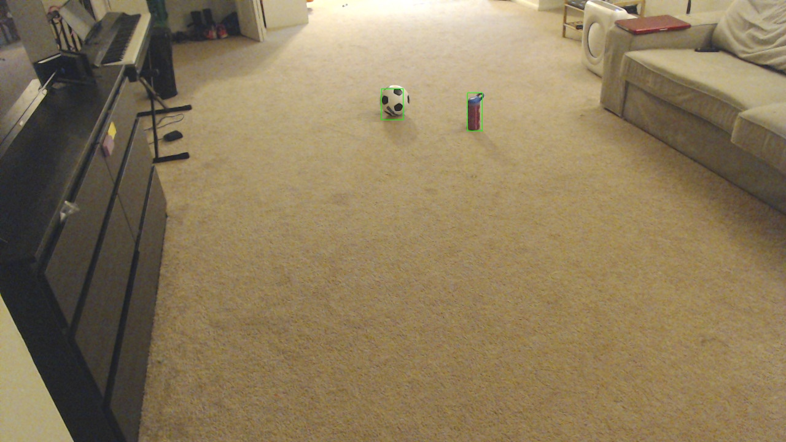

# Litter Monitor for home using [opencv](https://opencv.org)

## Description
My home becomes messy quickly in a day due to my kids littering the space. It becomes a chore for My wife and I to clean up after them everytime. Covid has made the mess even more worse since the kids are in home all day. Even though it is such fun to have your little ones write notes on pieces of paper, they usually throw it on the floor once it is done. It is difficult to go after them to ask them to cleanup. This itself becomes a chore for us. I decided to hand off this chore to an AI.

## What does the litter monitor do
- It takes snapshot of the room every 5 minutes
- Checks if a new object appeared in the screen, makes a note of the object.
- If the object again appears in the same location after 5 mins
    - takes the snapshot picture and draws a rectangle around the identified object
    - displays the picture, with the object identified in Roku tv
    - The image stays on Roku tv until someone picks up the object
- If someone picked up the object(litter) or there is no object in the hall, then the picture is cleared in tv

## Things you need
### Hardware
1. 2 rasperry pis, along with [canakit power supply](https://www.amazon.com/CanaKit-Raspberry-Supply-Adapter-Listed/dp/B00MARDJZ4/ref=sr_1_4?crid=2UP81XV7O9UFT&dchild=1&keywords=canakit+power+supply+raspberry+pi+3&qid=1609617363&sprefix=canakit+power%2Caps%2C168&sr=8-4). Both the raspberry should have [raspbian lite](https://downloads.raspberrypi.org/raspios_lite_armhf/images/raspios_lite_armhf-2020-12-04/2020-12-02-raspios-buster-armhf-lite.zip)
    - First, a [rasperry pi zero w](https://www.raspberrypi.org/products/raspberry-pi-zero-w/) connected to camera and take snapshot of the room every 5 seconds.
    - Second, a [raspberry pi 4 gb](https://www.raspberrypi.org/products/raspberry-pi-4-model-b/)is the base station to process the images, identify the litter and display it in Roku tv
2. 1 web camera. I'm using [this one](https://www.amazon.com/Logitech-C920x-Pro-HD-Webcam/dp/B085TFF7M1/ref=asc_df_B085TFF7M1/?tag=hyprod-20&linkCode=df0&hvadid=459641872450&hvpos=&hvnetw=g&hvrand=14789005238761658484&hvpone=&hvptwo=&hvqmt=&hvdev=c&hvdvcmdl=&hvlocint=&hvlocphy=9007245&hvtargid=pla-943627420681&psc=1)
3. Any roku enabled tv will do [Roku stick](https://www.amazon.com/Roku-Express-Streaming-Media-Player/dp/B07WVFCVJN/ref=sr_1_3?dchild=1&keywords=roku+stick&qid=1609617787&sr=8-3). I'm using [TCL 55 inch Roku tv](https://www.pcrichard.com/TCL/TCL-55inch-S525-Series-4K-2160p-UHD-Roku-Smart-LED-TV-with-HDR-2019-Model/55S525.pcrp)

### Sotware
1. [Nginx](https://www.nginx.com) to serve the snapshot image from pi zero
2. [fswebcam](http://www.sanslogic.co.uk/fswebcam/) utility to grab the image from webcame and save it to a file
3. [opencv](https://opencv.org) to process the camera output

### Installation in raspberry pi zero
1. Install nginx in raspberry pi zero
```
sudo apt-get install fswebcam
```

2. Create a script to execute the fswebcam with [content](resources/scripts/webcam_capture.sh)
```
sudo vi  /home/pi/webcam_capture.sh
chmod +x /home/pi/snapshots/camtest.jpg
```

3. Create a daemon to execute the [script](resources/config/webcam.service) on raspberry pi restart
```
sudo vi /etc/systemd/system/webcam.service
```
Enable and start the service
```
sudo systemctl enable webcam.service
sudo systemctl restart webcam.service
```

4. Install nginx and setup nginx to serve the directory /home/pi/snapshots/ where fswebcam writes the jpg file.
/etc/nginx/sites-enabled/default should have the content [default](resources/config/default)
```
sudo apt-get install nginx
sudo vi /etc/nginx/sites-enabled/default
sudo /etc/init.d/nginx restart
```

Now you should be able to see the snapshot from webcam when browsing pizero at http://camerapi/camtest.jpg 


This output will be displayed in your tv when it detects an object. Notice how the laptop was open in the clean image, but was not flagged in the second image. It was masked. Look at the [notebook](resources/litter-monitor.ipynb) to understand the code behind this.


### Installation in raspberry pi 4
1. Install opencv
```
sudo apt-get install libatlas-base-dev
sudo apt install python3-opencv
pip3 install jupyter
```
2. [Install plex server](https://pimylifeup.com/raspberry-pi-plex-server/)

3. Install litter-monitor
```
git clone  https://github.com/ravi9884/machine-learning-portfolio.git
cd machine-learning-portfolio/litter-monitor
```

4. Run litter monitor
```
python setup.py develop
nohup litter_monitor "/home/pi/litter_storage" "http://camerapi/camtest.jpg" "192.168.1.108" "55\" TCL Roku TV" "litter_monitor" "litter_photos" "192.168.1.136" 60 0730 2130
```

### Continue hacking with notebook
For code and explanation of how this works, continue with the [notebook](resources/litter-monitor.ipynb)

## References
1. This [Stack Overflow answer](https://stackoverflow.com/questions/65507967/how-can-i-get-a-list-of-objects-that-appeared-newly-in-an-image-with-opencv/65515341?noredirect=1#comment115830581_65515341) helped me a lot